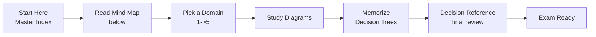
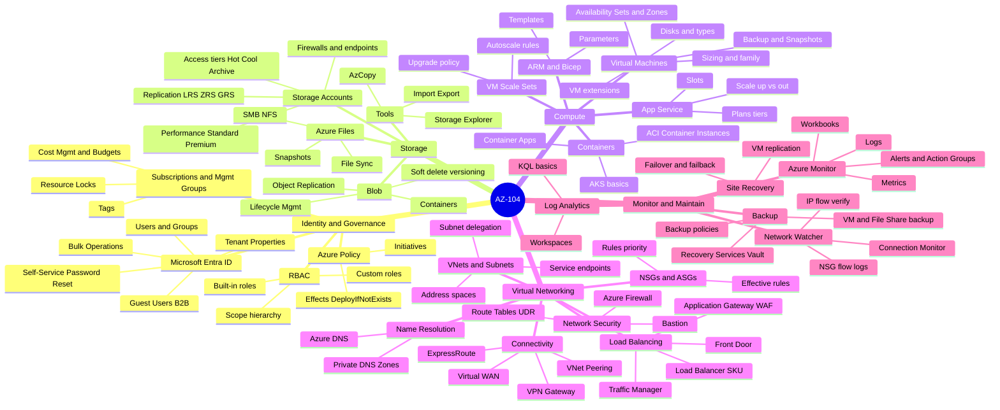
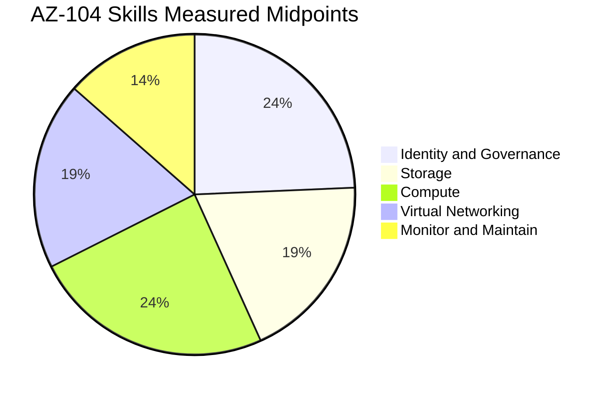
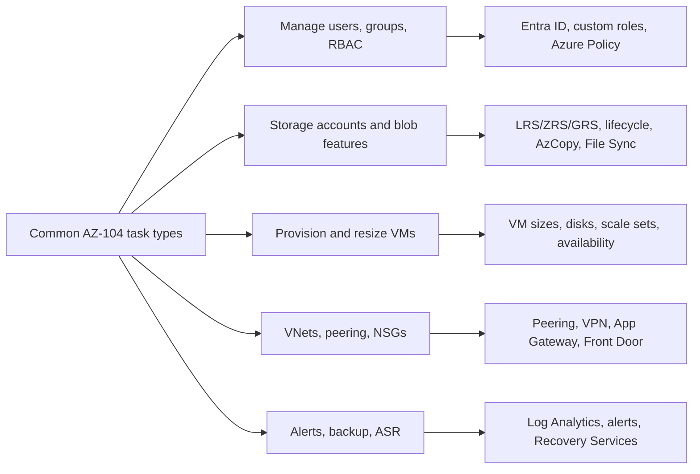
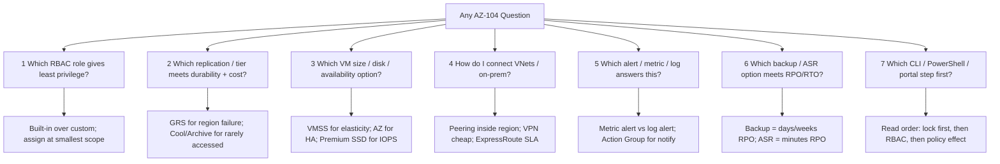
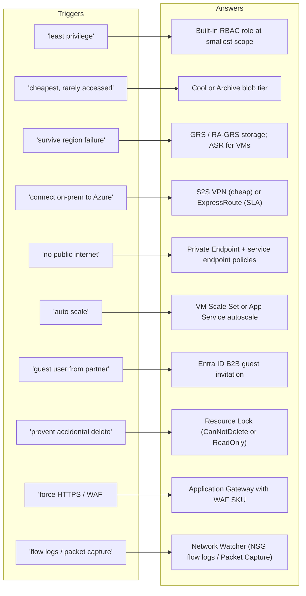

# AZ-104 Visual Study Guide - Master Index

> **Microsoft Azure Administrator**
> Visual concept layer aligned to the Microsoft Learn AZ-104 [skills measured](https://learn.microsoft.com/credentials/certifications/resources/study-guides/az-104). Diagrams, decision trees, and original summaries only - no exam questions reproduced.

---

## How to use this guide

---

## The 5 Exam Domains - Mind Map

---

## Official Skills Weighting

| Slice | Weight | Jump to chapter |
| --- | --- | --- |
| Identity and Governance | **20-25%** | [01 Identity & Governance](01-identity-governance.md) |
| Storage | **15-20%** | [02 Storage](02-storage.md) |
| Compute | **20-25%** | [03 Compute](03-compute.md) |
| Virtual Networking | **15-20%** | [04 Virtual Networking](04-virtual-networking.md) |
| Monitor and Maintain | **10-15%** | [05 Monitor & Maintain](05-monitor-maintain.md) |

Coverage note: this guide follows the official Microsoft Learn AZ-104 [skills measured](https://learn.microsoft.com/credentials/certifications/resources/study-guides/az-104) weights - Identity & Governance **20-25%**, Storage **15-20%**, Compute **20-25%**, Virtual Networking **15-20%**, Monitor & Maintain **10-15%**.

---

## Service emphasis map

Core services to know across the five measured skills: Microsoft Entra ID, Azure RBAC, Azure Policy, Storage Accounts (Blob, Files, Queues, Tables), Azure Virtual Machines, VM Scale Sets, App Service, Container Apps, AKS basics, Virtual Networks, NSGs, Application Gateway, Load Balancer, VPN Gateway, ExpressRoute, Azure Firewall, Bastion, Azure Monitor, Log Analytics, Application Insights, Azure Backup, Azure Site Recovery, Network Watcher.

---

## Domain files in this guide

| # | Domain | File | Focus |
|---|--------|------|-------|
| 1 | Identity & Governance | [01-identity-governance.md](01-identity-governance.md) | Entra ID, RBAC, Subscriptions, Policy |
| 2 | Storage | [02-storage.md](02-storage.md) | Storage accounts, Blob, Files, AzCopy |
| 3 | Compute | [03-compute.md](03-compute.md) | VMs, VMSS, App Service, Containers, ARM |
| 4 | Virtual Networking | [04-virtual-networking.md](04-virtual-networking.md) | VNets, NSGs, Peering, VPN, LB, App GW |
| 5 | Monitor & Maintain | [05-monitor-maintain.md](05-monitor-maintain.md) | Monitor, Log Analytics, Backup, ASR |
| | **Exam Decision Reference** | [06-exam-cheatsheet.md](06-exam-cheatsheet.md) | Decision trees + scenario keyword map |
| + | **Extra Concepts** | [07-extra-az104-concepts.md](07-extra-az104-concepts.md) | Edge-case concepts, gotchas, CLI patterns |
| + | **Architectures - AZ-104** | [10-arch-az104.md](10-arch-az104.md) | Reference architectures mapped to each skill area |

---

## The 7 Core Question Patterns in AZ-104

---

## The "Magic Words" Translator

---

## Recommended study order

```mermaid
gantt
    title Suggested 8-day plan
    dateFormat X
    axisFormat Day %d
    section Core
    Identity & Governance :a1, 0, 1d
    Storage :a2, after a1, 1d
    Compute :a3, after a2, 2d
    section Network & Ops
    Virtual Networking :b1, after a3, 1d
    Monitor & Maintain :b2, after b1, 1d
    section Final
    Decision reference + practice :c1, after b2, 2d
```

**Next:** open [01-identity-governance.md](01-identity-governance.md)
