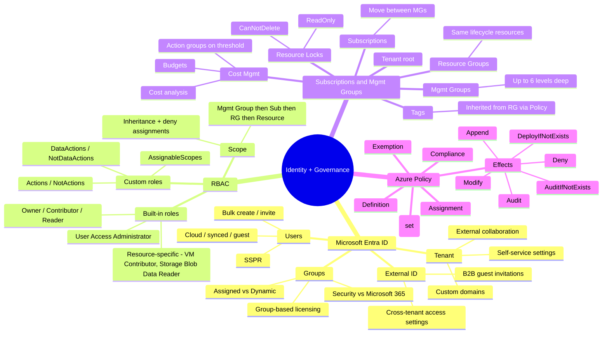
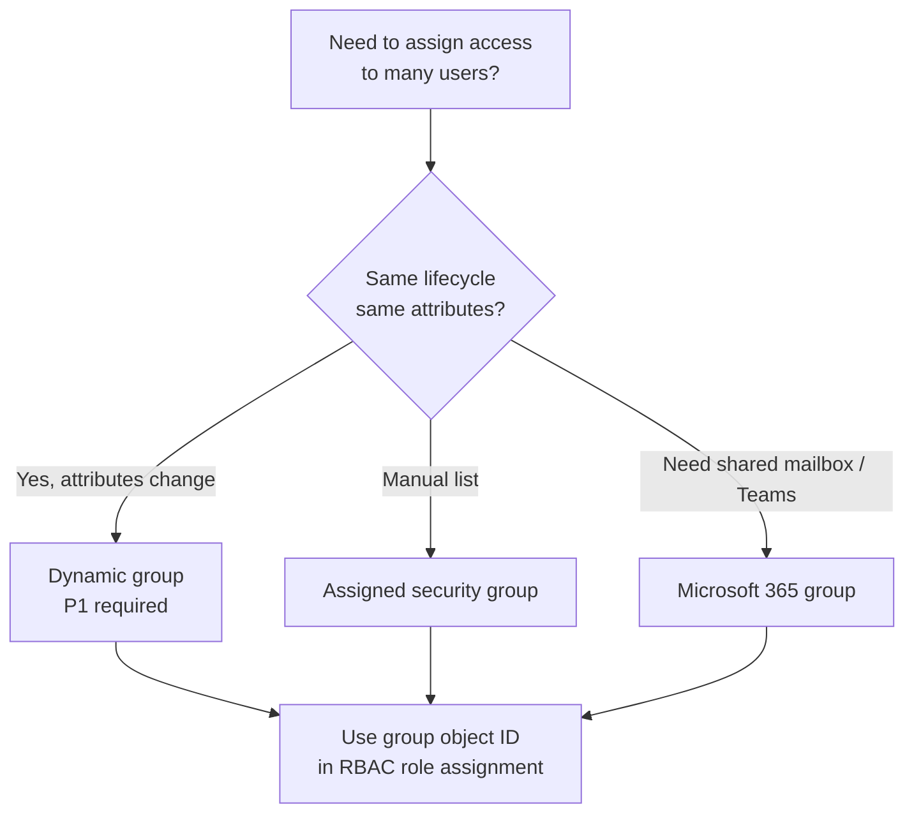
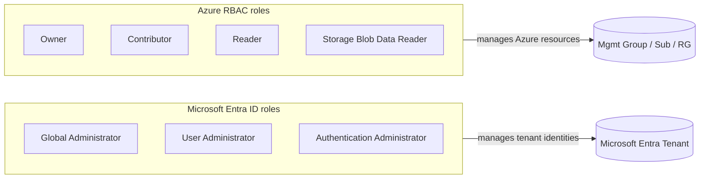
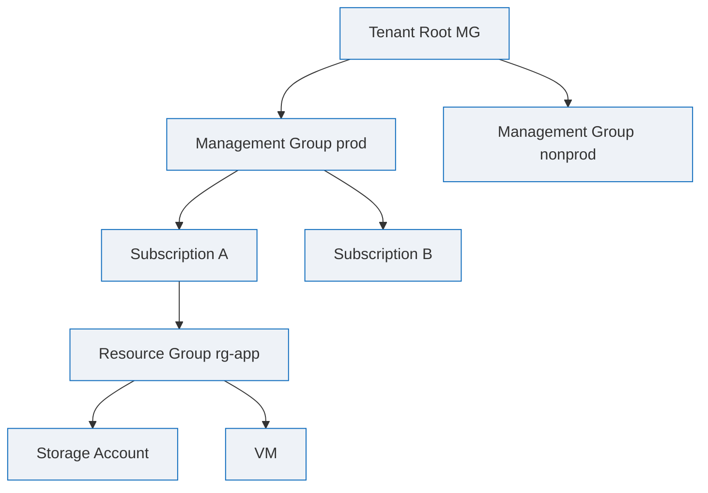
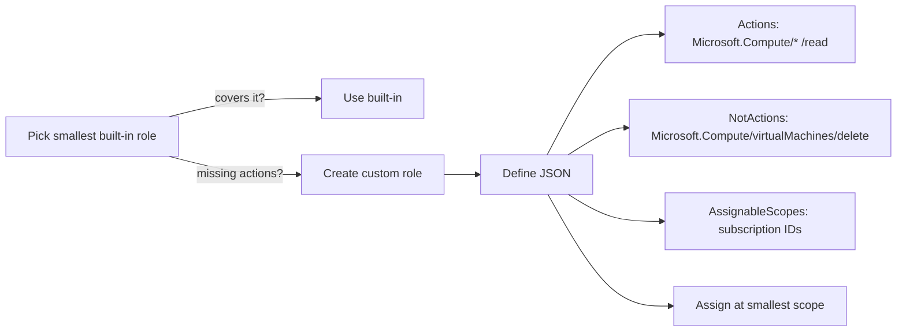
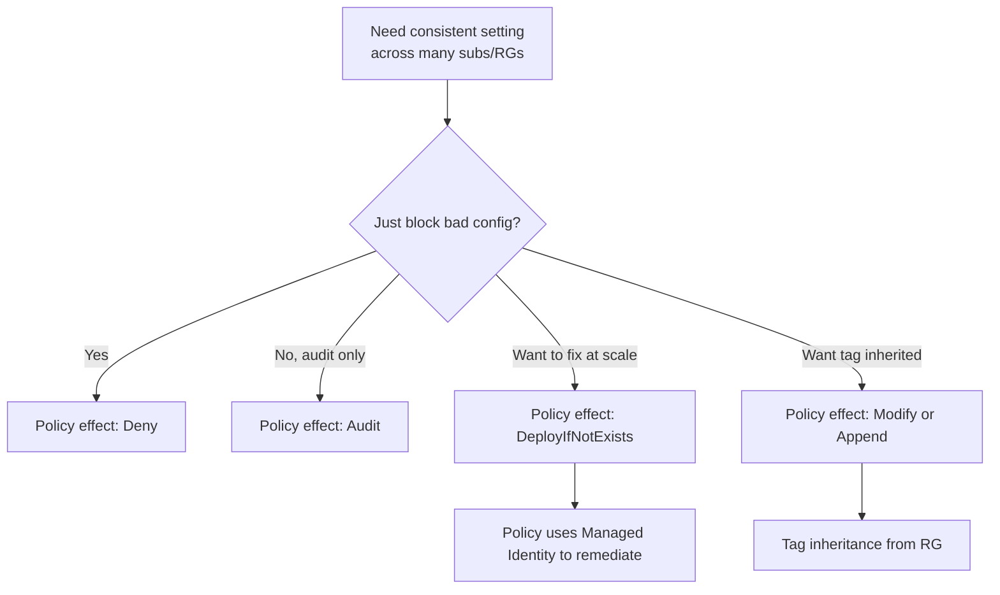
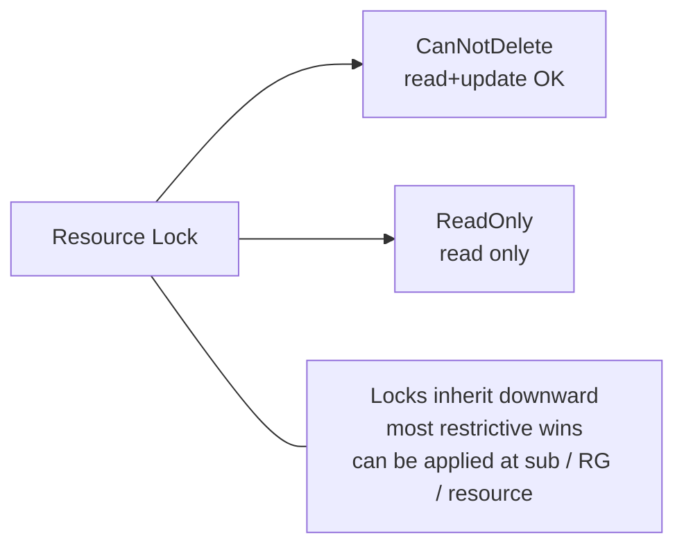
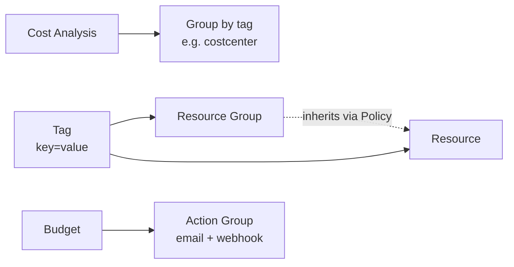

# 1. Identity and Governance (20-25%)

> Manage Microsoft Entra ID objects, RBAC, subscriptions and governance, and Azure Policy.

---

## Domain mind map

---

## Entra ID objects at a glance

| Object | Created where | Synced from on-prem? | Notes |
|---|---|---|---|
| Cloud user | Azure portal / Graph | No | Default for new tenant accounts |
| Synced user | On-prem AD via Entra Connect | Yes | Most attributes managed on-prem |
| Guest user (B2B) | Invited by email | No | External; consumes guest object in your tenant |
| Security group | Azure portal / Graph | Optionally synced | Used for RBAC / app assignment |
| Microsoft 365 group | Outlook / Teams / Graph | No | Adds shared mailbox + SharePoint site |
| Dynamic group | Membership rule | n/a | Requires Entra ID P1 license |

---

## Group membership decision tree

---

## RBAC vs Entra ID roles

| Question | Use |
|---|---|
| Reset a user password | Entra role (User Administrator) |
| Create a VM | Azure RBAC (Contributor) |
| Manage Conditional Access policies | Entra role (Conditional Access Admin) |
| Read blobs in a container | Azure RBAC (Storage Blob Data Reader) |
| Assign roles to others | User Access Administrator (Azure RBAC) **or** Owner |

---

## RBAC scope hierarchy

> Role assignments **inherit downward**. A `Reader` at Management Group applies to every subscription, RG and resource below it.

---

## Custom RBAC role recipe

Common gotchas:

- A user needs `Microsoft.Authorization/roleAssignments/write` to grant roles. That comes from **Owner** or **User Access Administrator**.
- Data plane vs management plane: listing blobs in the portal needs both `Reader` (mgmt) and `Storage Blob Data Reader` (data) on the storage account.
- `Contributor` cannot assign roles. Frequently tested.

---

## Subscriptions, governance, and Policy

| Effect | Use case |
|---|---|
| `Audit` | Report on non-compliance without blocking |
| `Deny` | Hard block at create/update time |
| `Append` | Add fields to a request (e.g. tag) |
| `Modify` | Add or update tags / properties on existing resources |
| `DeployIfNotExists` | Auto-remediate (e.g. enable diagnostic settings) |
| `AuditIfNotExists` | Flag resources missing a related resource |

---

## Resource locks

- A `ReadOnly` lock on a resource group blocks deleting an RG and **also** modifying any resource inside.
- Locks affect **management plane** only - data plane (e.g. blob writes) is unaffected.
- Removing a lock requires `Microsoft.Authorization/locks/*` (Owner or User Access Administrator).

---

## Tags and cost management

- Tags are not automatically inherited from RG to resources. Use the **Inherit a tag from the resource group** built-in policy (`Modify` effect).
- Maximum 50 tags per resource. Key length 512, value length 256.

---

## Identity exam clue patterns

| Phrase in question | Likely answer |
|---|---|
| "least privilege" | Built-in RBAC role at the lowest scope that works |
| "self-service password reset" | Enable SSPR; group-targeted in Entra ID |
| "external partner" | B2B guest invitation + cross-tenant access settings |
| "prevent users from deleting" | Resource Lock (CanNotDelete) |
| "audit all storage accounts for HTTPS" | Azure Policy (Audit effect) |
| "automatically enable diagnostic settings" | Azure Policy (DeployIfNotExists) with managed identity |
| "see costs by team" | Tags + Cost analysis grouped by tag |

---

**Next:** [02-storage.md](02-storage.md)
