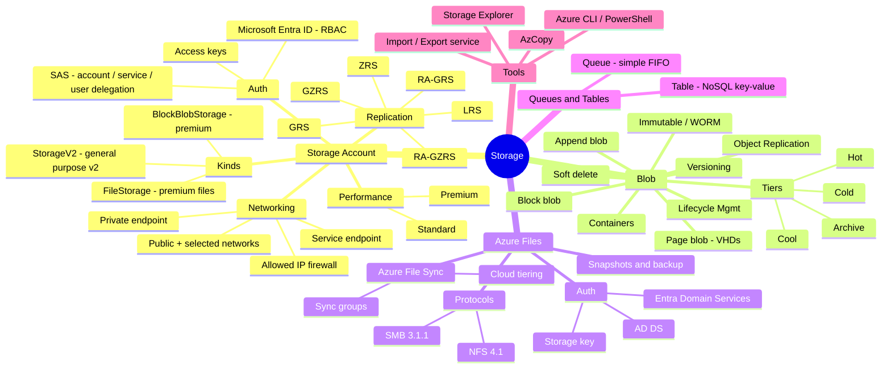
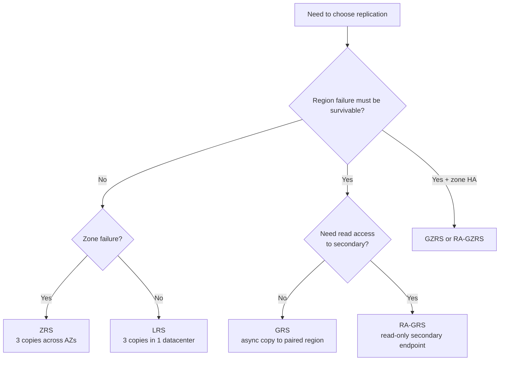
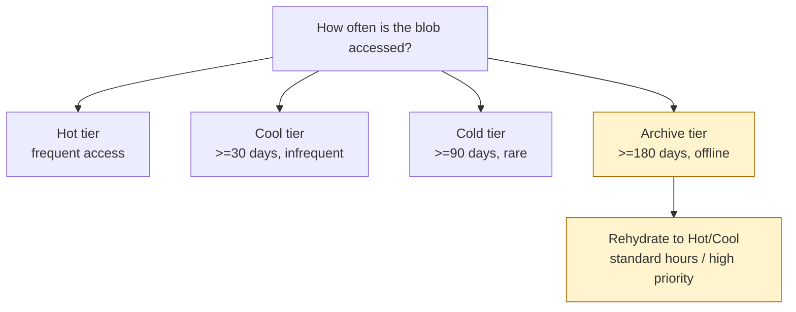
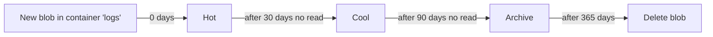
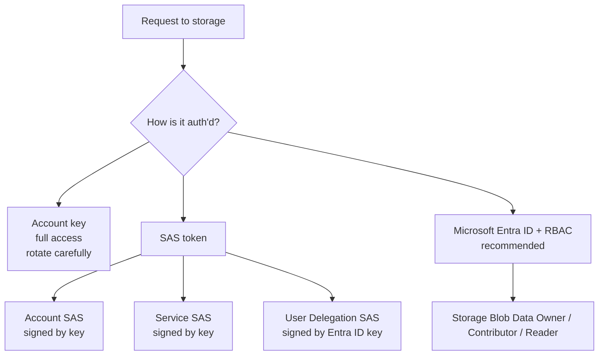
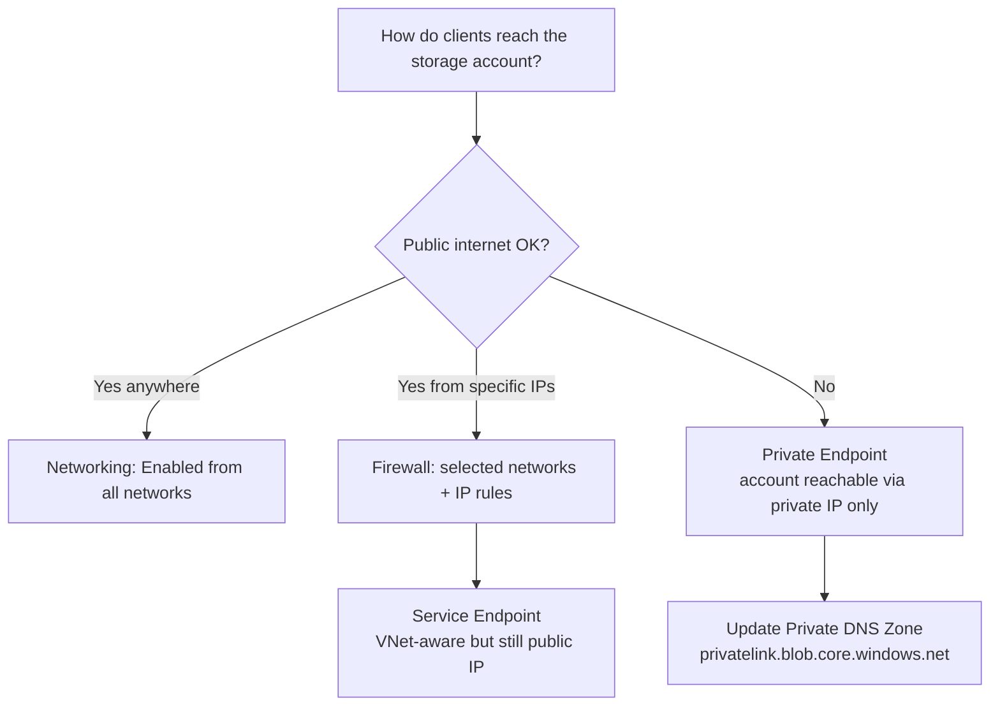
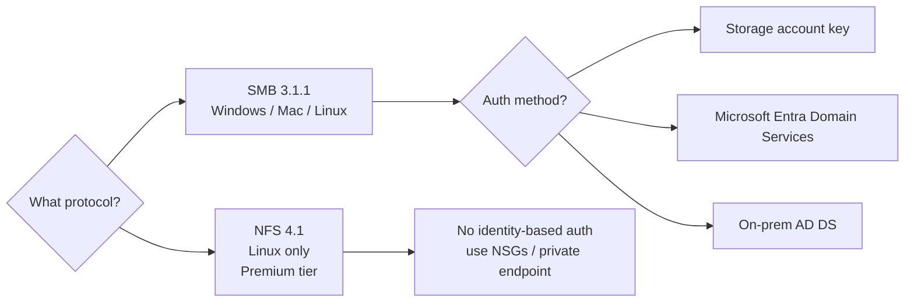
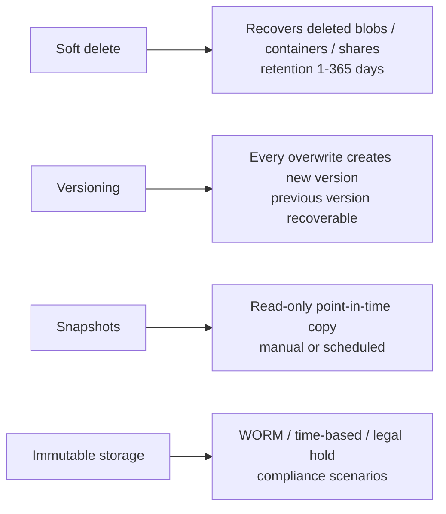

# 2. Storage (15-20%)

> Storage accounts, Blob, Files, Queues, Tables, lifecycle, AzCopy, and access control.

---

## Domain mind map

---

## Pick a replication option

| Option | Copies | Survives DC | Survives Zone | Survives Region |
|---|---|---|---|---|
| LRS | 3 in one DC | n | n | n |
| ZRS | 3 across AZs | y | y | n |
| GRS | 6 (3+3 paired region) | y | n in primary | y (after failover) |
| RA-GRS | Same as GRS + read endpoint | y | n | y + read anytime |
| GZRS | 3 across AZs + 3 in paired region | y | y | y |
| RA-GZRS | GZRS + read endpoint | y | y | y + read anytime |

---

## Pick a blob tier

Trade-off: **higher access cost** for cool/cold/archive, but **lower storage cost**. Archive is offline; data is unavailable until rehydrated.

---

## Lifecycle management example

Lifecycle rules can target by **prefix**, **blob index tag**, **last modified**, **last access** (when access tracking enabled).

---

## Authorization options

- Prefer **User Delegation SAS** over account-key SAS - it can be revoked by rotating the user delegation key, not the account key.
- Use **RBAC + Managed Identity** for app code wherever possible.
- Disable shared key access where compliance requires it (`allowSharedKeyAccess = false`).

---

## SAS quick reference

| Type | Signed by | Scope | Notes |
|---|---|---|---|
| Account SAS | Account key | All services in account | Can grant control-plane operations |
| Service SAS | Account key | One service (blob/file/queue/table) | Can be tied to a stored access policy |
| User Delegation SAS | Entra ID OAuth token | Blob only | Most secure; revocable |

---

## Network access decision

Private endpoint vs service endpoint:

- **Service endpoint** = traffic from the VNet uses Microsoft backbone but the storage account still has a public IP.
- **Private endpoint** = the storage account gets a **private IP** in your VNet via Private Link.

---

## Azure Files: when to use what

**Azure File Sync** centralizes on-prem file servers around Azure Files:

- Cloud endpoint (file share) + server endpoints (Windows servers).
- **Cloud tiering** keeps frequently-used files local; cold files become reparse points.
- Backups happen on the cloud endpoint via Azure Backup.

---

## Tooling cheat sheet

| Need to... | Use |
|---|---|
| Bulk copy local -> blob | `azcopy copy "C:\data\*" "https://acct.blob.core.windows.net/c?<SAS>"` |
| Sync (one-way) | `azcopy sync` |
| Move data offline (TBs) | Azure Import/Export (BYOD) or Data Box |
| Browse and edit interactively | Azure Storage Explorer |
| Mount Azure Files on Linux | `mount -t cifs` (SMB) or `mount -t nfs` (NFS) |
| Mount on Windows | `net use` with storage key or AD identity |

---

## Soft delete vs versioning vs snapshots

---

## Storage exam clue patterns

| Phrase | Likely answer |
|---|---|
| "rarely accessed but kept for years" | Cool / Archive tier with lifecycle rule |
| "must survive a region failure" | GRS / RA-GRS / GZRS |
| "Linux file share" | Azure Files NFS (Premium) |
| "centralize branch file servers" | Azure File Sync |
| "no public IP on storage" | Private Endpoint + Private DNS zone |
| "give a contractor temporary access" | User Delegation SAS |
| "regulatory immutable retention" | Immutable Blob Storage (time-based / legal hold) |
| "bulk upload from on-prem" | AzCopy or Data Box |

---

**Next:** [03-compute.md](03-compute.md)
