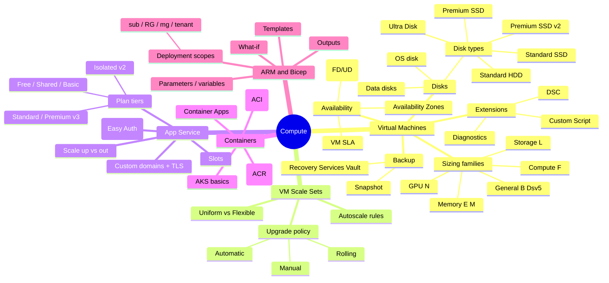
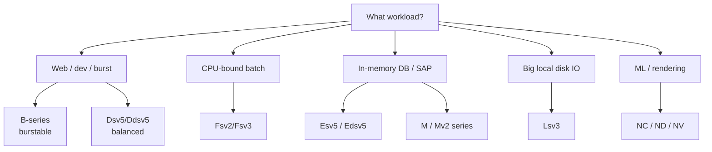
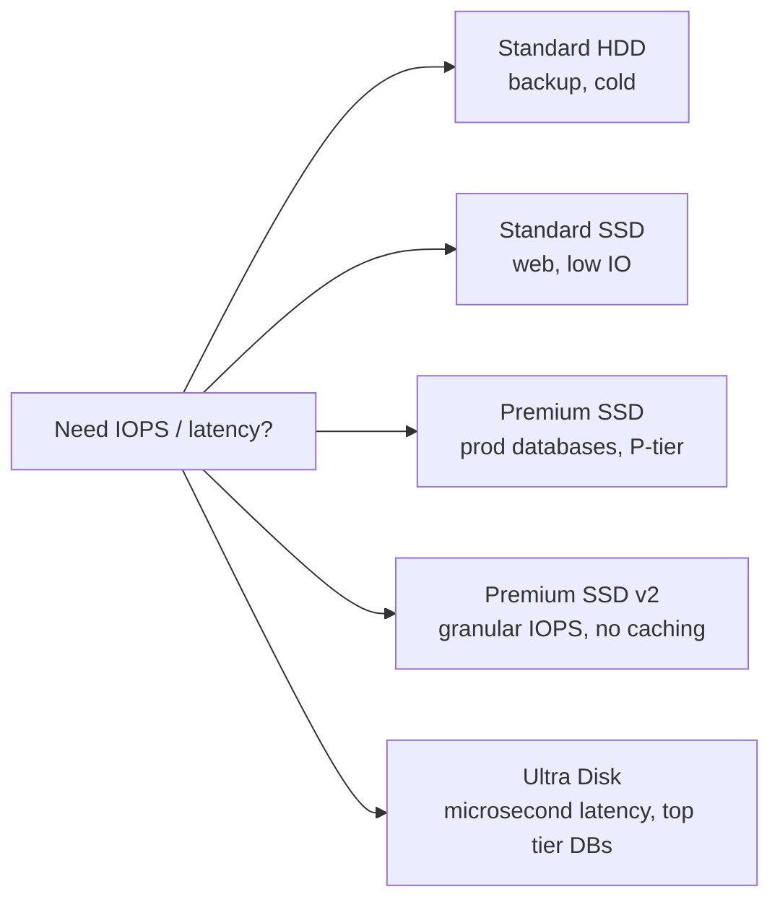
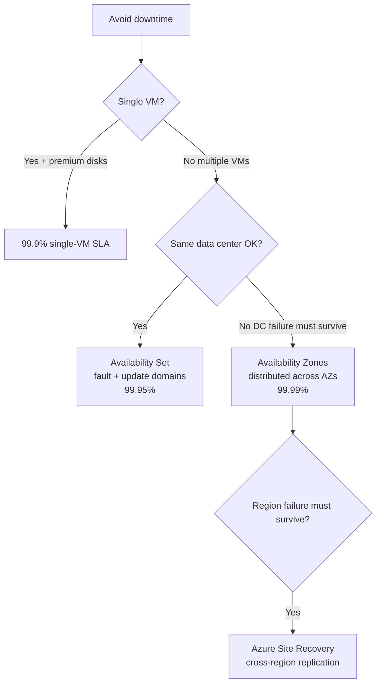
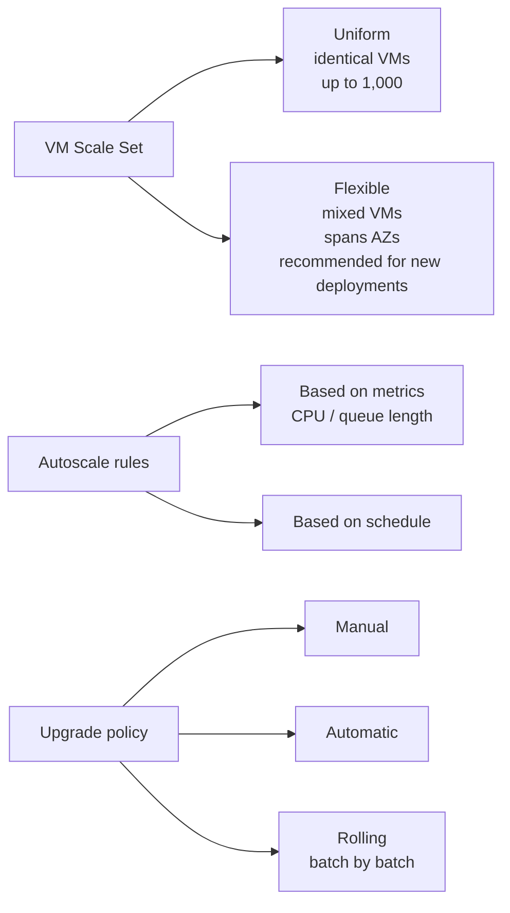
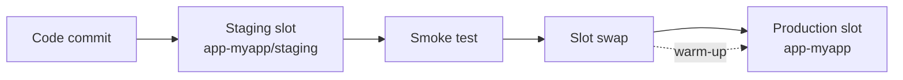
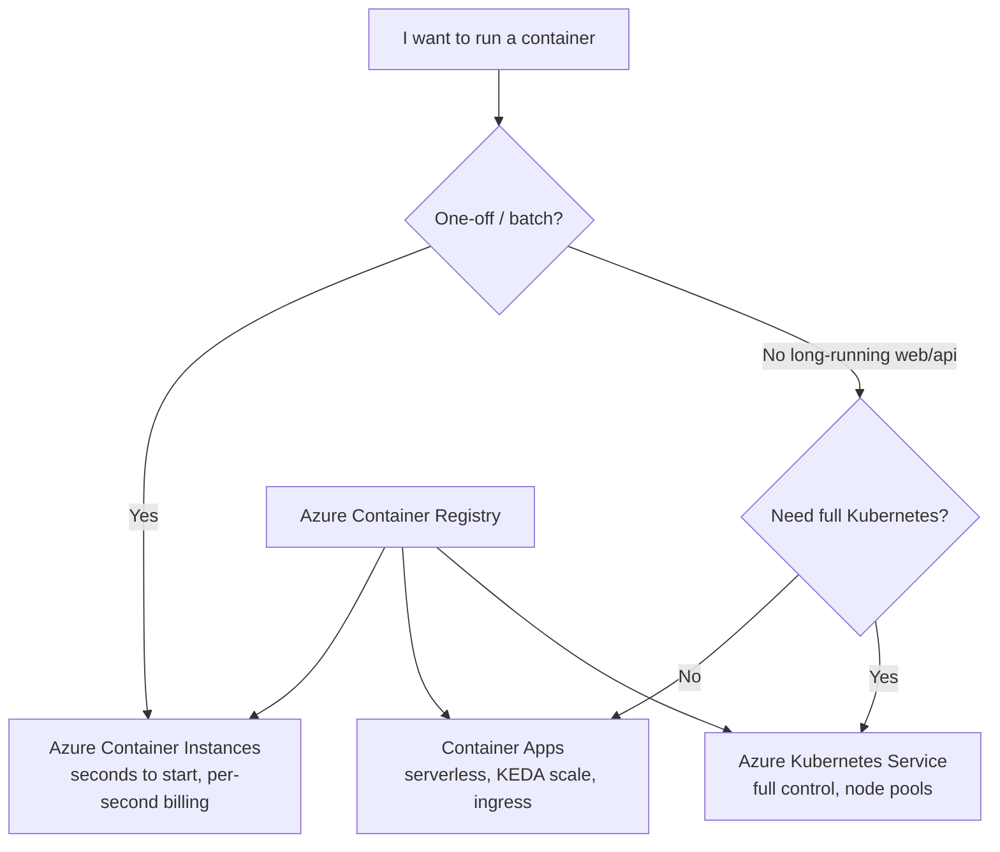
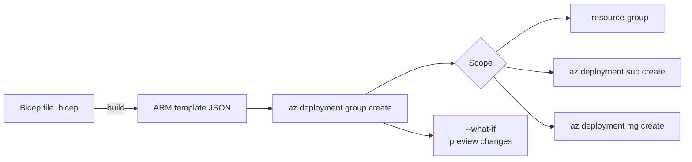

# 3. Compute (20-25%)

> Virtual Machines, Scale Sets, App Service, Containers, and ARM/Bicep.

---

## Domain mind map



---

## VM size decision tree



| Family | Letter clue | Use case |
|---|---|---|
| General | A, B, D | Mixed workloads, web, dev/test |
| Compute | F | High CPU per RAM (batch, gaming servers) |
| Memory | E, M | Databases, in-memory analytics, SAP |
| Storage | L | Big Data, NoSQL, low-latency local SSD |
| GPU | N | Training, inference, visualization |

---

## Disk types



Memorize: **Premium SSD** is required to get the **single-instance VM SLA**. **Ultra Disk** + **Premium SSD v2** can independently dial IOPS and throughput.

---

## VM availability options



| Construct | Protects against | SLA |
|---|---|---|
| Single VM (Premium) | Hardware failure of disks | 99.9% |
| Availability Set (FD + UD) | Rack / host updates | 99.95% |
| Availability Zone | Datacenter outage | 99.99% |
| Region pair / ASR | Whole-region outage | n/a - depends on RPO/RTO |

You **cannot** add an existing VM to an Availability Set after creation. You must redeploy.

---

## VM Scale Set quick reference



- Flexible orchestration is the **default** for new scale sets and is preferred unless you specifically need Uniform features.
- Autoscale: define **scale-out** rule (e.g. avg CPU > 70%) and a **scale-in** rule (e.g. avg CPU < 30%). Always include both.
- Cooldown prevents flapping. Default 5 minutes.

---

## App Service plan tiers

| Tier | Use case | Custom domain + TLS | Scale out | Slots | VNet integration |
|---|---|---|---|---|---|
| Free | Learning | Default `azurewebsites.net` only | No | No | No |
| Shared | Light dev | Custom domain only | No | No | No |
| Basic | Test | y | Manual up to 3 | No | No |
| Standard | Prod small | y | Auto up to 10 | 5 slots | y |
| Premium v3 | Prod | y | Auto up to 30 | 20 slots | y |
| Isolated v2 (ASE) | Regulated | y | Up to 100 | 20 slots | Dedicated VNet |

---

## App Service deployment slots



- Slot swap performs **warm-up** of the staging slot first, then swaps DNS/traffic.
- **Slot settings** (sticky settings) stay with the slot during a swap (e.g. connection strings).
- Auto swap can swap automatically once warm-up succeeds.

---

## Containers in AZ-104 scope



ACR tiers:

- **Basic / Standard** differ mostly by storage and throughput.
- **Premium** adds geo-replication, content trust, private link, customer-managed keys, retention policy.

---

## ARM templates and Bicep



Key concepts:

- Templates are **idempotent** - running the same template twice converges to the same state.
- `dependsOn` is implicit when you reference another resource by symbolic name in Bicep.
- `outputs` expose values for nested or pipeline consumption.
- Use `what-if` before `deploy` to preview create / modify / delete actions.

Sample Bicep snippet:

```bicep
param location string = resourceGroup().location
param vmName string

resource nic 'Microsoft.Network/networkInterfaces@2023-09-01' = {
  name: '${vmName}-nic'
  location: location
  properties: { /* ... */ }
}

resource vm 'Microsoft.Compute/virtualMachines@2024-03-01' = {
  name: vmName
  location: location
  properties: {
    hardwareProfile: { vmSize: 'Standard_D2s_v5' }
    networkProfile: { networkInterfaces: [ { id: nic.id } ] }
    /* osProfile, storageProfile ... */
  }
}
```

---

## Compute exam clue patterns

| Phrase | Likely answer |
|---|---|
| "auto scale based on CPU" | VMSS autoscale rule (or App Service autoscale) |
| "no downtime during host maintenance" | Availability Set |
| "survive datacenter failure" | Availability Zones |
| "test in production safely" | App Service deployment slot |
| "burst CPU, idle most of the time" | B-series VM |
| "preview infra changes before deploy" | `az deployment ... --what-if` |
| "lightweight, run a container 10 minutes" | Azure Container Instances |
| "serverless container web app" | Azure Container Apps |
| "minimum admin overhead for K8s" | AKS (managed control plane) |

---

**Next:** [04-virtual-networking.md](04-virtual-networking.md)
