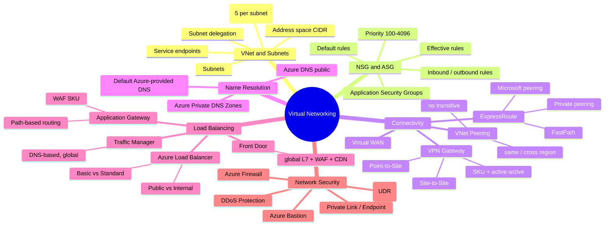
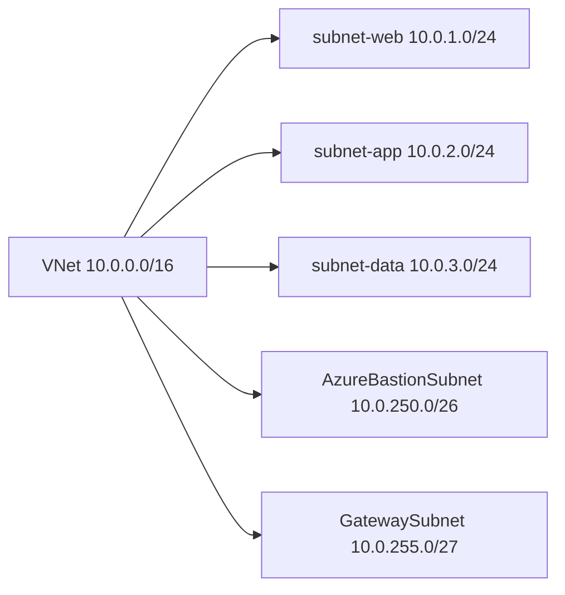
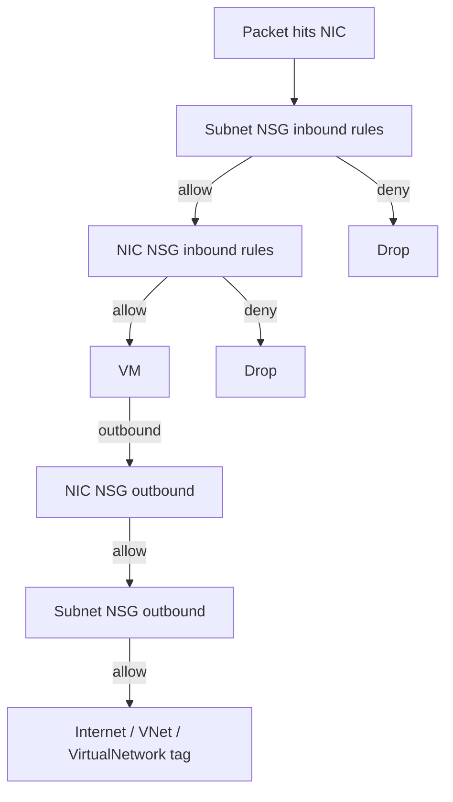
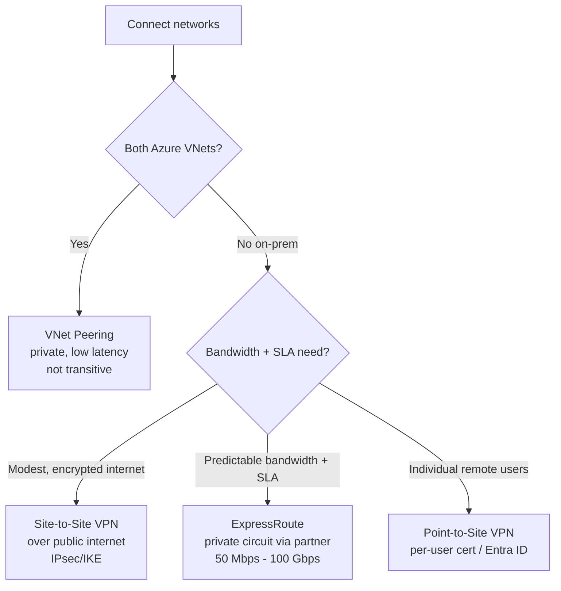
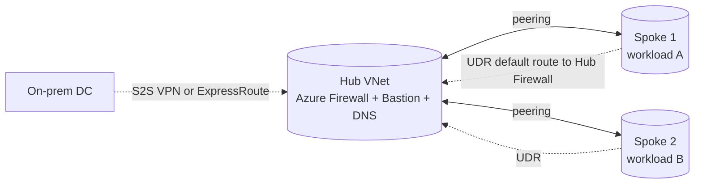
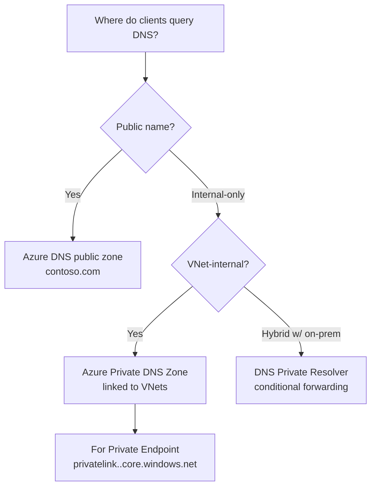
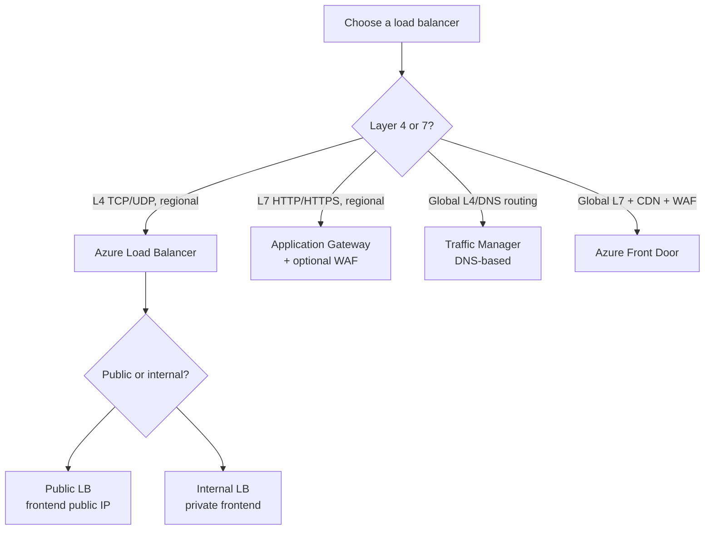
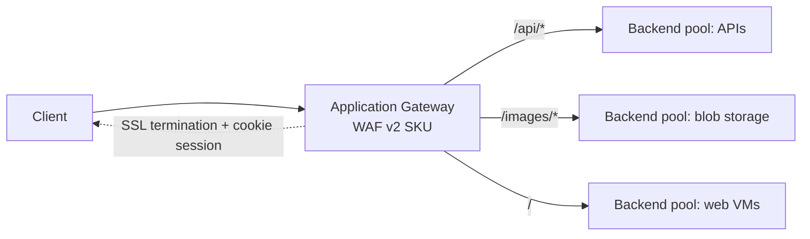
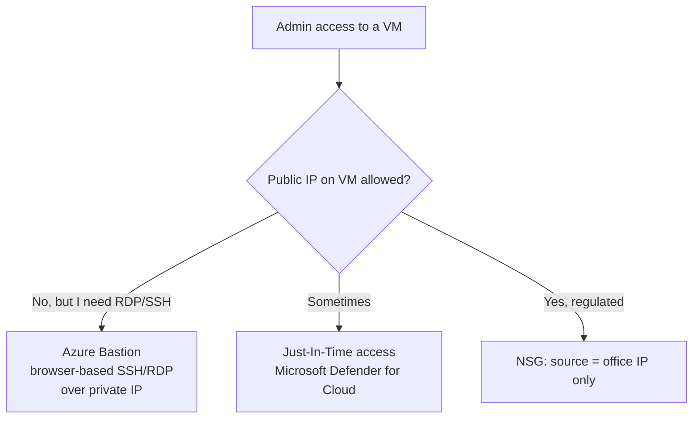

# 4. Virtual Networking (15-20%)

> VNets, subnets, NSGs, peering, VPN/ExpressRoute, name resolution, load balancing, and network security.

---

## Domain mind map

---

## VNet and subnet basics

Reserved IPs in **every** subnet (first 4 + last):

| Offset | Use |
|---|---|
| `.0` | Network address |
| `.1` | Default gateway |
| `.2`, `.3` | Azure DNS |
| last (`.255` in /24) | Broadcast |

So a `/24` subnet has 256 - 5 = **251 usable IPs**.

Special required subnet names:

- `GatewaySubnet` for VPN / ExpressRoute gateway (recommended `/27` or larger).
- `AzureBastionSubnet` for Bastion (`/26` or larger).
- `AzureFirewallSubnet` for Azure Firewall (`/26` or larger).

---

## NSG decision flow

NSG rule mechanics:

- Rules are processed by **priority** (100 = highest, 4096 = lowest).
- First match wins; remaining rules are ignored.
- Default rules (priority 65000+) cannot be deleted but can be overridden.
- Use **service tags** (`Internet`, `VirtualNetwork`, `AzureLoadBalancer`, `Storage`) instead of IP ranges where possible.
- **Application Security Groups (ASGs)** group VMs by role (e.g. `asg-web`, `asg-db`) so rules use names instead of IPs.

---

## VNet peering vs VPN vs ExpressRoute

| Option | Encryption | Bandwidth | SLA | Use |
|---|---|---|---|---|
| VNet Peering | Microsoft backbone | High | Yes | Azure-to-Azure |
| Site-to-Site VPN | IPsec | Up to ~1.25 Gbps | 99.95% | On-prem branch / DC |
| Point-to-Site VPN | IPsec / OpenVPN | Per user | n/a | Remote users |
| ExpressRoute | Private (no public internet) | Up to 100 Gbps | 99.95% | Large enterprise |
| ExpressRoute Direct | Private | 10/100 Gbps | 99.95% | Massive throughput |

**Peering is non-transitive.** A -> B and B -> C does **not** give A -> C. Use a hub VNet with **Azure Firewall / NVA + UDR**, or **Virtual WAN**, to enable transitive routing.

---

## Hub-and-spoke pattern

User-Defined Routes (UDR) on spoke subnets force traffic through the hub firewall. This enables **transitive** spoke-to-spoke and spoke-to-on-prem routing.

---

## Name resolution decision

When you create a **Private Endpoint**, you must integrate with a Private DNS zone (or your own DNS) so the FQDN resolves to the private IP.

---

## Load balancing decision tree

| Service | Layer | Scope | Best for |
|---|---|---|---|
| Azure Load Balancer | L4 | Regional | Internal microservice LB, non-HTTP TCP |
| Application Gateway | L7 | Regional | HTTPS, WAF, path/host routing inside region |
| Traffic Manager | DNS | Global | Endpoint failover by DNS, any protocol |
| Azure Front Door | L7 | Global | Global HTTP(S), WAF, CDN, anycast IP |

Standard Load Balancer requires **Standard Public IP** and supports **AZs**. Basic LB is being deprecated.

---

## Application Gateway features

- **Listeners** receive traffic (Basic / Multi-site).
- **Rules** map listeners to backend pools.
- **Health probes** mark backend instances healthy/unhealthy.
- WAF SKU adds OWASP rule sets and bot protection.

---

## Bastion vs jump VM vs public IP

Bastion is deployed into **AzureBastionSubnet**. The target VM does not need a public IP.

---

## UDR mini reference

| Next hop type | Use case |
|---|---|
| `Internet` | Force traffic to the public internet |
| `Virtual network` | Default within VNet |
| `Virtual network gateway` | Send to on-prem |
| `Virtual appliance` | Send to NVA / Azure Firewall |
| `None` | Drop the traffic |

---

## Networking exam clue patterns

| Phrase | Likely answer |
|---|---|
| "non-transitive routing problem" | Hub-and-spoke + Azure Firewall + UDR, or Virtual WAN |
| "private connectivity to PaaS" | Private Endpoint + Private DNS zone |
| "WAF / OWASP" | Application Gateway WAF v2 or Front Door WAF |
| "lowest-latency global" | Front Door (anycast) |
| "secure RDP/SSH without public IP" | Azure Bastion |
| "must allow exact ports between subnets" | NSG rules with ASGs |
| "encrypted tunnel to one branch office" | S2S VPN |
| "predictable 10 Gbps to data center" | ExpressRoute |
| "remote employees connect from laptops" | Point-to-Site VPN |
| "block VM internet egress" | UDR with `0.0.0.0/0` next hop = `None`, or via Azure Firewall |

---

**Next:** [05-monitor-maintain.md](05-monitor-maintain.md)
