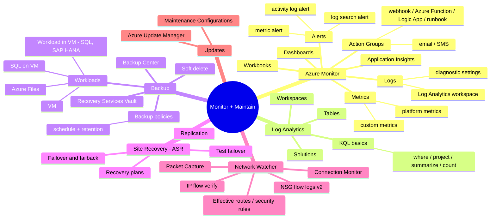
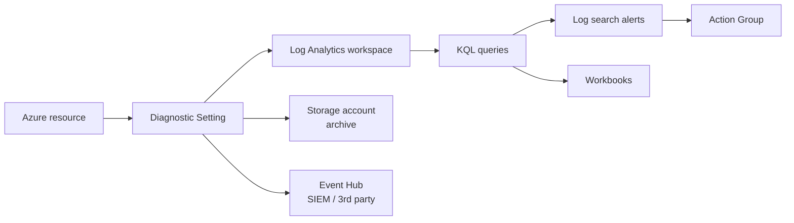
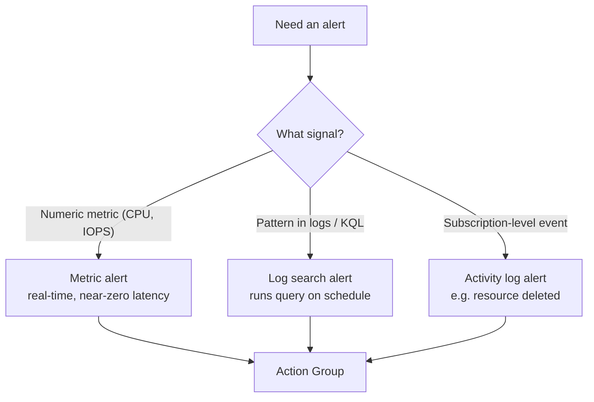
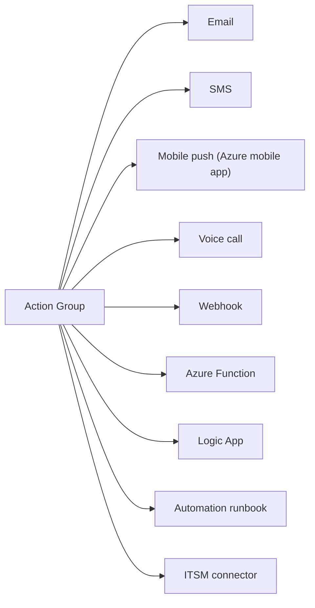
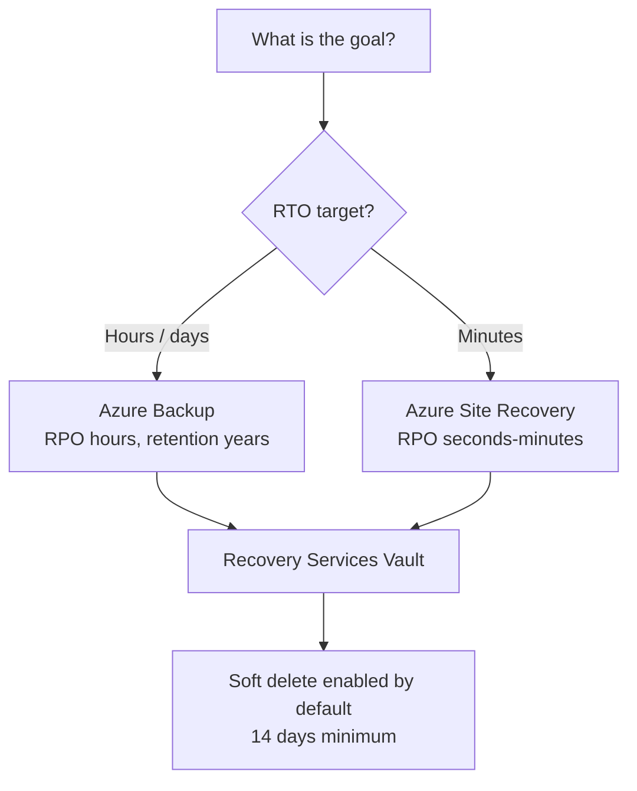
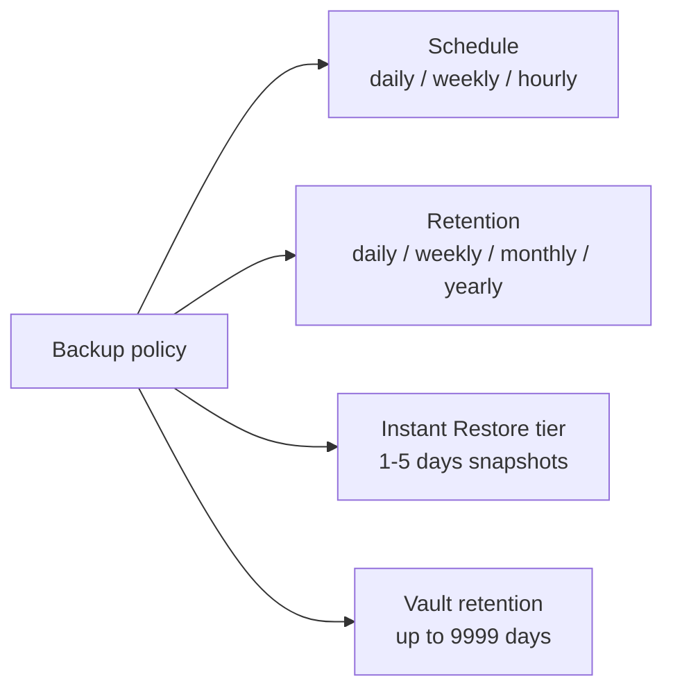
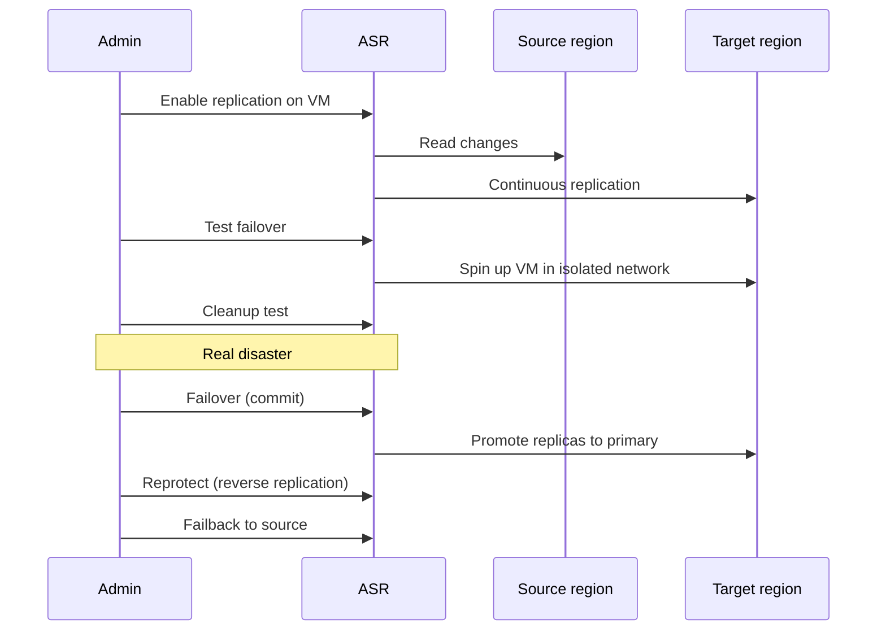
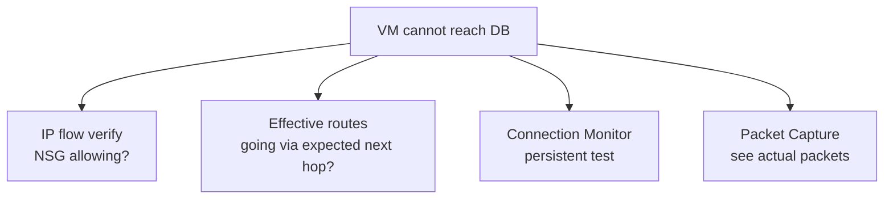
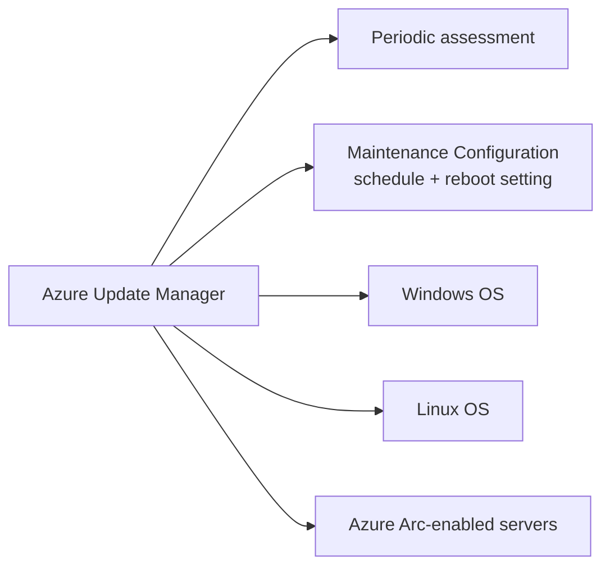

# 5. Monitor and Maintain (10-15%)

> Azure Monitor, Log Analytics, alerts, Backup, Site Recovery, and Network Watcher.

---

## Domain mind map



---

## Diagnostic data path



A diagnostic setting can route to **up to 5 destinations** - one Log Analytics workspace, one or more storage accounts, and one or more Event Hubs / partner integrations.

---

## Alert types



| Alert type | Signal | Latency | Cost driver |
|---|---|---|---|
| Metric alert | Platform / custom metrics | Near real-time | Per metric monitored |
| Log search alert | KQL over Log Analytics | Min frequency 1-5 min | Per query execution |
| Activity log alert | Subscription events | Seconds | Free |

---

## Action Group destinations



---

## KQL quick reference

```kql
// Errors in last hour by application
AppExceptions
| where TimeGenerated > ago(1h)
| summarize count() by AppRoleName, ProblemId
| order by count_ desc

// VMs with average CPU > 80% over 5 minutes
Perf
| where ObjectName == "Processor" and CounterName == "% Processor Time"
| summarize avg(CounterValue) by Computer, bin(TimeGenerated, 5m)
| where avg_CounterValue > 80
```

Top operators:

- `where` filter rows
- `project` keep specific columns
- `extend` add a calculated column
- `summarize ... by` aggregate
- `join` combine tables
- `bin(timestamp, span)` bucket time

---

## Backup vs Site Recovery



| Capability | Azure Backup | Azure Site Recovery |
|---|---|---|
| Primary purpose | Long-term data retention | Disaster recovery / region failover |
| RPO | Hours (or app-consistent) | Seconds-minutes |
| RTO | Hours | Minutes |
| Stores | Backup data in vault | Replica disks in target region |
| Test recovery | File / disk restore | Test failover (non-disruptive) |

Azure Backup workloads:

- Azure VM backup (agentless snapshot).
- Azure Files backup (share snapshot).
- SQL Server / SAP HANA in Azure VM (workload backup extension).
- On-prem servers via MARS agent or MABS / DPM.

---

## Backup policy components



Soft delete on Recovery Services Vault is **enabled by default** and cannot be disabled below 14 days; Enhanced soft delete adds immutability.

---

## ASR failover lifecycle



Always run a **test failover** quarterly. Document recovery plans (groups + scripts + manual actions).

---

## Network Watcher tools

| Tool | Use |
|---|---|
| Connection Monitor | End-to-end reachability + latency over time |
| IP flow verify | "Is this packet allowed by NSG rules right now?" |
| Effective security rules | Combined NSG result on a NIC |
| Effective routes | Final routing table on a NIC |
| NSG flow logs (v2) | Persisted flow records to storage; analyze in Traffic Analytics |
| Packet Capture | tcpdump-like capture from VM extension |
| Connection Troubleshoot | One-time test from VM A to endpoint X |



---

## Updates and maintenance



Use **Maintenance Configurations** to apply patches in waves (e.g. ring 1 dev -> ring 2 test -> ring 3 prod).

---

## Monitor exam clue patterns

| Phrase | Likely answer |
|---|---|
| "alert on disk space < 10%" | Metric alert on `OSDiskFreePercentage` (or KQL log search if guest metric) |
| "send notification + create ticket" | Action Group with email + ITSM connector |
| "diagnostic logs to SIEM" | Diagnostic setting -> Event Hub |
| "store NSG flows" | NSG flow logs v2 -> storage account; Traffic Analytics for visualization |
| "RPO of seconds, cross-region" | Azure Site Recovery |
| "30-day backup retention" | Azure Backup policy with 30-day daily retention |
| "test failover without impact" | ASR Test failover into isolated VNet |
| "patch all VMs Tuesday 2 am" | Azure Update Manager + Maintenance Configuration |

---

**Next:** [06-exam-cheatsheet.md](06-exam-cheatsheet.md)
