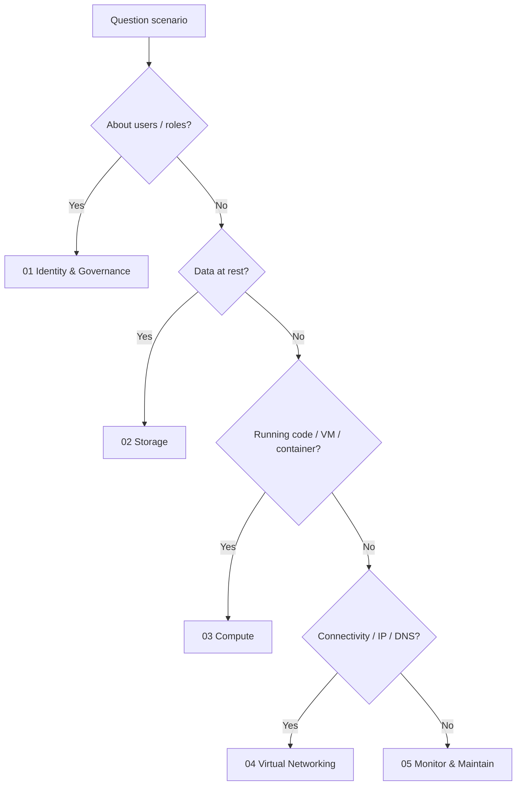
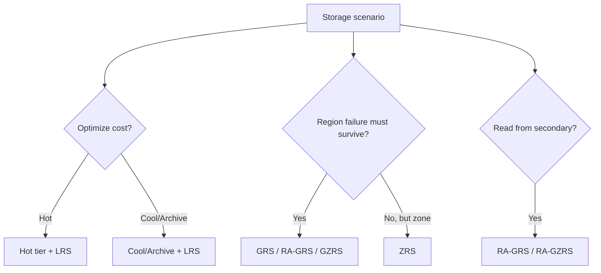
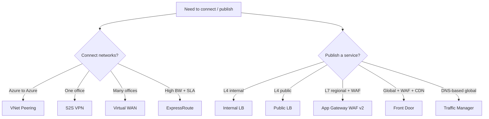

# 6. Exam Decision Reference

> One-page-per-topic decision aids for the AZ-104 exam. Use this as your last-night review.

---

## Master "what service?" decision tree

---

## RBAC "what role" cheat

| Need to... | Smallest built-in role |
|---|---|
| Read everything in a sub | Reader |
| Create/manage resources but not access management | Contributor |
| Assign roles | User Access Administrator (or Owner) |
| Read blobs | Storage Blob Data Reader |
| Write blobs | Storage Blob Data Contributor |
| Manage VMs | Virtual Machine Contributor |
| Read secrets in Key Vault | Key Vault Secrets User (RBAC mode) |
| Manage networks | Network Contributor |
| Restart a VM only | Custom role with `Microsoft.Compute/virtualMachines/restart/action` |

---

## Replication / tier picker

---

## VM availability picker

| Required SLA | Use |
|---|---|
| 99.9% | Single VM with Premium SSD |
| 99.95% | Availability Set (FD + UD) |
| 99.99% | Availability Zones (>=2 VMs in different AZs) |
| Cross-region DR | Azure Site Recovery |

---

## Networking picker

---

## Backup vs ASR vs HA

| Need | Service |
|---|---|
| Recover deleted file from yesterday | Azure Backup |
| Recover entire VM after region outage | Azure Site Recovery |
| Survive a rack failure with no admin work | Availability Set |
| Survive a datacenter outage | Availability Zones |
| Survive a region outage | ASR or paired-region GRS |
| Long-term immutable retention for compliance | Recovery Services Vault soft delete + WORM blob |

---

## Policy effect picker

| Goal | Effect |
|---|---|
| Just report non-compliance | Audit |
| Block creation | Deny |
| Add tag at create | Append |
| Update tags on existing resources | Modify |
| Auto-deploy missing resource | DeployIfNotExists |
| Flag missing related resource | AuditIfNotExists |

---

## "What command" picker

| Task | Tool |
|---|---|
| Quick portal-less resource scan | `az resource list` |
| Bulk copy local -> blob | `azcopy copy` |
| Browse and edit blobs interactively | Storage Explorer |
| Deploy ARM/Bicep | `az deployment group create` |
| Preview deployment changes | `... --what-if` |
| Run a one-off script in a VM | Run Command (portal) or `az vm run-command invoke` |
| RDP/SSH without a public IP | Azure Bastion |

---

## Top "magic words" recap

| Phrase | Service / setting |
|---|---|
| "least privilege" | RBAC built-in role at smallest scope |
| "self-service password reset" | Entra ID SSPR |
| "B2B / external partner" | Entra External ID guest invitation |
| "prevent delete" | Resource Lock CanNotDelete |
| "compliance audit" | Azure Policy Audit / Initiative |
| "auto-fix non-compliance" | DeployIfNotExists with managed identity |
| "rarely accessed" | Cool / Archive blob tier |
| "immutable / WORM" | Immutable Blob Storage |
| "no public IP" | Private Endpoint |
| "burst CPU" | B-series VM |
| "no downtime during host updates" | Availability Set |
| "DC outage tolerant" | Availability Zones |
| "cross-region DR" | Azure Site Recovery |
| "flow logs" | NSG flow logs v2 + Traffic Analytics |
| "force HTTPS, OWASP" | App Gateway WAF v2 |
| "global low-latency HTTP" | Front Door |
| "centralize file servers" | Azure File Sync |

---

## Final review checklist

- [ ] I can name FD/UD count for an Availability Set (default 5 UD, 3 FD).
- [ ] I can compute usable IPs in a `/24` subnet (251).
- [ ] I know which subnet names are reserved (`GatewaySubnet`, `AzureBastionSubnet`, `AzureFirewallSubnet`).
- [ ] I can list the 6 storage replication options and which survive what.
- [ ] I can pick blob tiers given access frequency.
- [ ] I can choose between Backup and Site Recovery.
- [ ] I can write a custom RBAC role with `Actions` / `NotActions`.
- [ ] I know where Azure Policy effects fit (Audit / Deny / DINE / Modify).
- [ ] I can describe hub-and-spoke + UDR for transitive routing.
- [ ] I can pick LB vs App Gateway vs Front Door vs Traffic Manager.

---

**Next:** [07-extra-az104-concepts.md](07-extra-az104-concepts.md)
