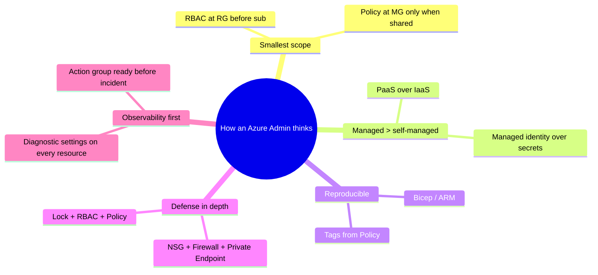
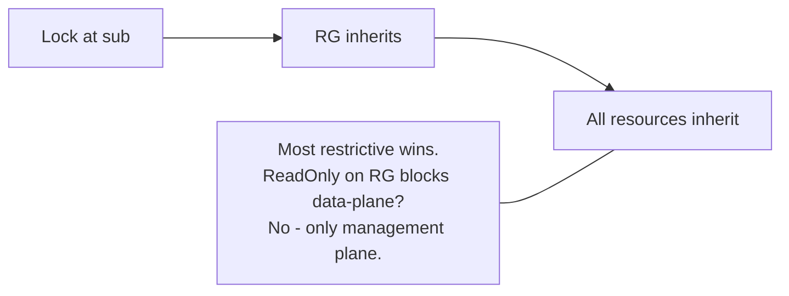
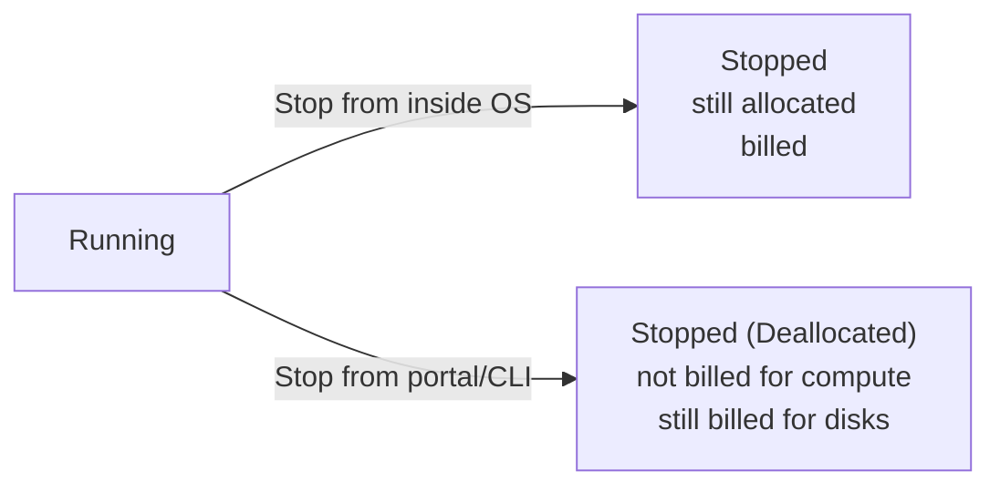
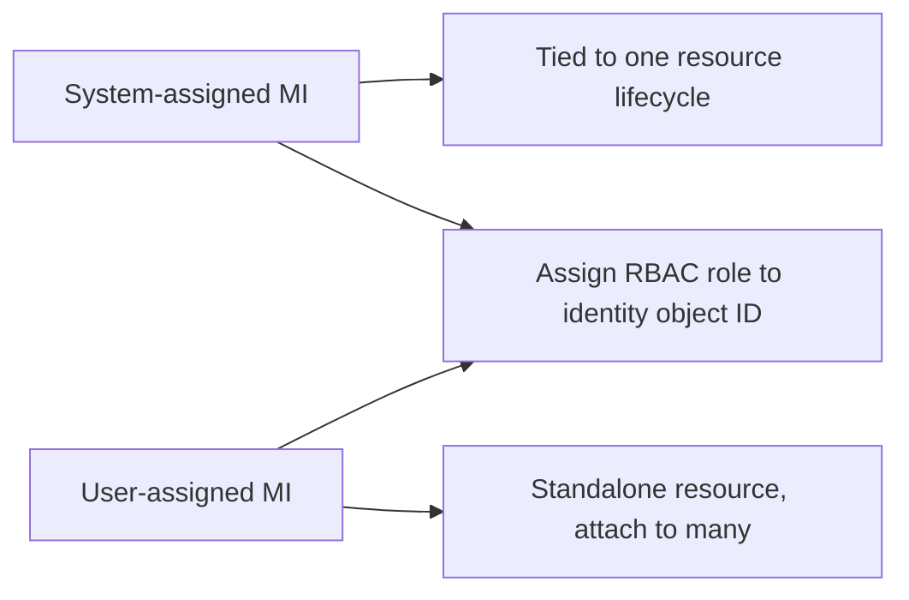
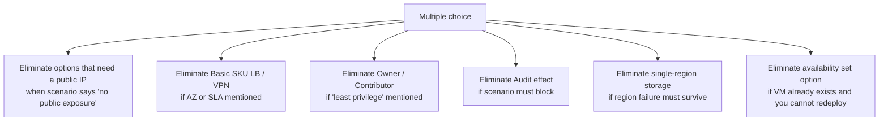

# 7. Extra AZ-104 Concepts

> Edge-case topics, exam-adjacent details, common gotchas, and CLI/PowerShell patterns that frequently show up in AZ-104 scenarios.

---

## Administrator answer style



---

## Resource provider, scope, and ARM ID anatomy

```text
/subscriptions/{subId}/resourceGroups/{rg}/providers/Microsoft.Compute/virtualMachines/{vmName}
                ^                    ^                   ^                                ^
                |                    |                   |                                |
            scope-1 sub          scope-2 RG       resource provider                resource name
```

- A **resource provider** must be **registered** in a subscription before its types can be used (`az provider register --namespace Microsoft.Compute`).
- Some operations need provider features (`az feature register`).

---

## Tag inheritance traps

- Tags applied to a **resource group** are **not** automatically applied to its resources.
- Use the built-in policy "Inherit a tag from the resource group" with `Modify` effect to push them down.
- Tags do not flow up - tagging a resource never changes the RG's tags.

---

## Resource locks gotchas



- A `ReadOnly` lock on an RG **blocks creating new resources** in it (a write op on the RG).
- Locks do **not** prevent reading or writing data inside resources (e.g. blob uploads still work with a `ReadOnly` lock on the storage account).
- Removing a lock requires `Microsoft.Authorization/locks/delete` (Owner / UAA).

---

## Storage account name and DNS rules

- 3-24 chars, **lowercase letters and numbers only**, globally unique.
- Endpoint pattern: `https://{name}.blob.core.windows.net/{container}/{blob}`.
- Files: `https://{name}.file.core.windows.net/{share}`.
- Private Link FQDN: `{name}.privatelink.blob.core.windows.net`.

---

## Disk caching guidance

| Disk role | Caching |
|---|---|
| OS disk | ReadWrite (default) |
| Data disk for read-heavy workloads | ReadOnly |
| Data disk for transaction logs / DB writes | None |
| Premium SSD v2 / Ultra Disk | No host caching available |

Wrong caching is a common cause of poor disk performance after a migration.

---

## Stopped vs Stopped (deallocated)



Only **Stopped (Deallocated)** stops compute charges. A VM stopped from inside the OS keeps the host reserved.

---

## VM extensions you should recognize

| Extension | Purpose |
|---|---|
| Custom Script Extension | Run a script at deployment |
| Azure Monitor Agent (AMA) | Replaces Log Analytics agent (deprecated) |
| Microsoft Antimalware | Built-in AV for Windows |
| Network Watcher Agent | Required for Connection Monitor + Packet Capture |
| Backup VM Snapshot Extension | Auto-installed when VM backup enabled |
| Disk Encryption | BitLocker / dm-crypt (CMK) |
| AAD Login | Sign in to VM with Entra ID identity |

---

## Managed identity mini reference



Code retrieves a token from `http://169.254.169.254/metadata/identity/oauth2/token` (IMDS) - never embed secrets.

---

## Azure CLI / PowerShell patterns

```bash
# Login
az login
az account set --subscription "Prod-Sub"

# Common admin tasks
az group create -n rg-app -l eastus
az vm list -d -o table
az network nsg rule create -g rg-app --nsg-name nsg-web -n allow-https \
  --priority 200 --access Allow --protocol Tcp --direction Inbound \
  --source-address-prefixes Internet --destination-port-ranges 443
az role assignment create --assignee user@contoso.com \
  --role "Reader" --scope /subscriptions/{id}/resourceGroups/rg-app
az policy assignment create --name require-https \
  --policy 404c3081-a854-4457-ae30-26a93ef643f9 \
  --scope /subscriptions/{id}
```

```powershell
Connect-AzAccount
Set-AzContext -SubscriptionName "Prod-Sub"

New-AzResourceGroup -Name rg-app -Location eastus
Get-AzVM -Status | Format-Table Name, PowerState, Location

New-AzRoleAssignment -SignInName user@contoso.com `
  -RoleDefinitionName "Reader" `
  -ResourceGroupName rg-app
```

---

## Azure Resource Graph (KQL for resources)

```kql
Resources
| where type =~ "microsoft.compute/virtualmachines"
| where properties.hardwareProfile.vmSize startswith "Standard_B"
| project name, resourceGroup, location, vmSize = properties.hardwareProfile.vmSize
| order by name asc
```

Use `az graph query -q "..."` to run from the CLI. Great for inventorying across subscriptions.

---

## Bicep mini patterns

```bicep
// Loop
resource sa 'Microsoft.Storage/storageAccounts@2023-05-01' = [for i in range(0, 3): {
  name: 'sa${uniqueString(resourceGroup().id)}${i}'
  location: resourceGroup().location
  sku: { name: 'Standard_LRS' }
  kind: 'StorageV2'
}]

// Conditional
resource pip 'Microsoft.Network/publicIPAddresses@2024-01-01' = if (createPublicIp) {
  name: 'pip-${vmName}'
  location: location
  sku: { name: 'Standard' }
  properties: { publicIPAllocationMethod: 'Static' }
}

// Module
module net 'modules/network.bicep' = {
  name: 'network-deploy'
  params: { location: location }
}
```

---

## Common elimination rules



---

## Things people forget

- An Availability Set cannot be added to an existing VM.
- A Recovery Services Vault and the resource it protects must be in the **same region**.
- ExpressRoute does **not** encrypt by default - add MACsec (ER Direct) or IPsec over ER.
- A Private Endpoint requires DNS configuration; otherwise clients still resolve to the public IP.
- `Owner` cannot bypass an Azure Policy `Deny` effect.
- Soft delete on storage and on Recovery Services Vault are separate features.
- `azcopy login` uses Entra ID; avoid baking SAS into scripts.
- Bastion needs its own dedicated `AzureBastionSubnet` (`/26` minimum) and a Standard public IP.

---

## Recommended Microsoft Learn paths

- AZ-104 [Skills measured](https://learn.microsoft.com/credentials/certifications/resources/study-guides/az-104)
- [Microsoft Azure Administrator learning path](https://learn.microsoft.com/training/courses/az-104t00)
- [Azure Architecture Center](https://learn.microsoft.com/azure/architecture/) for cross-domain patterns

---

**End of guide.** Loop back to [00-MASTER-INDEX.md](00-MASTER-INDEX.md) any time.
